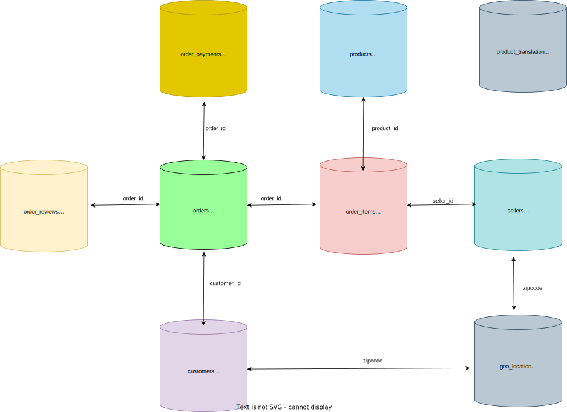

# 📦 Olist Decision Science — Supplier Profit Optimisation


[](https://abby-tingzhi-wang.github.io/olist-decision-science/CEO_request_slides.html)

---

## 💡 Executive Summary

> **Objective:** Help Olist's CEO evaluate seller-level profitability and make a data-driven decision on supplier management strategy.

| Metric | Current | After Optimisation | Change |
|---|---|---|---|
| **Net Profit** | BRL 667,609 | BRL 1,070,976 | **+BRL 403,367 ↑** |
| **Profit Margin** | 23.96% | 24.97% | **+1.01% ↑** |

**Finding:** 29% of Olist's sellers (855 out of 2,967) generate negative value when reputation costs and IT costs are factored in. Removing them increases net profit by BRL 403,367.

**Recommendation:** Implement a dynamic, performance-based seller removal strategy with ongoing monitoring of review scores and profitability metrics.

---

## 🏢 Business Context

[Olist](https://olist.com/) is Brazil's largest B2B marketplace platform, connecting small businesses to major online retailers. The dataset covers **100,000 orders from Oct 2016 to Oct 2018** across sellers, customers, products, payments, and reviews.

**Revenue model:**
- 10% commission on product sales price
- BRL 80 monthly subscription fee per seller

**Cost drivers:**
- **Reputation costs** — bad reviews trigger support, refund, and reputation repair costs (1★: BRL 100, 2★: BRL 50, 3★: BRL 40, 4-5★: BRL 0)
- **IT costs** — scale non-linearly with number of sellers and total items sold: `IT Cost = 3157.27 × √(#sellers) + 978.23 × √(#items)`

**Financial overview (baseline):**
- Total Revenue: BRL 2.79M (Sales fees: BRL 1.36M + Subscriptions: BRL 1.43M)
- Total Costs: BRL 2.12M (Review costs: BRL 1.62M + IT costs: BRL 0.5M)
- Net Profit: BRL ~667K

---

## 🗂️ Project Structure

```bash
.
├── CEO_request.ipynb                         # Final business recommendation notebook
├── supplier_profitability_analysis.ipynb     # What-if simulation & profit optimisation model
├── Seller_analysis/                          # SQL + Python seller-level analysis
│   └── Seller_analysis.ipynb
├── Customer_analysis/                        # SQL + Python customer behaviour analysis
│   └── Customer_analysis.ipynb
├── Product_analysis/                         # SQL + Python product performance analysis
│   └── Product_Analysis.ipynb
├── Frequency_analysis_of_orders/             # Order frequency and delivery patterns
│   └── Frequency_analysis_of_orders.ipynb
├── Miscellaneous/                            # Additional exploratory analysis
│   └── Miscellaneous.ipynb
├── olist_data/                               # Raw CSV datasets
├── olist_entity.svg                          # Entity relationship diagram (ERD)
├── create_table.sql                          # PostgreSQL schema creation script
├── import_data.sql                           # PostgreSQL data import script
├── CEO_request_slides.html                   # Live CEO presentation (Reveal.js slides)
└── README.md
```

---

## 🗃️ Database Schema

The database is modelled as a **star schema** with `orders` as the central fact table:



| Table | Description |
|---|---|
| `orders` | Transaction records — status, timestamps, delivery dates |
| `order_items` | Line-item detail — product, seller, price, freight |
| `customers` | Customer master — location, unique ID |
| `sellers` | Seller master — location, registration |
| `products` | Product catalogue — category, dimensions, weight |
| `order_reviews` | Review scores and comments per order |
| `order_payments` | Payment method, instalments, value |
| `geo_location` | Zip code to lat/long mapping |

---

## 🔍 Analysis Breakdown

### 1. SQL Exploratory Analysis (PostgreSQL)

Four deep-dive analyses built in PostgreSQL and documented as notebooks with markdown:

| Analysis | Key Questions |
|---|---|
| **Order Frequency** | When do customers order? What are peak periods? How long does delivery take? |
| **Customer Analysis** | Who are the most valuable customers? What markets are growing? |
| **Seller Analysis** | Which sellers drive the most revenue? Which have the worst review scores? |
| **Product Analysis** | Which categories perform best? What drives high freight costs? |

### 2. Seller Profitability Model (Python)

Built a custom **seller-level P&L model** to compute per-seller profitability accounting for:
- Revenue: sales commission (10%) + monthly subscription (BRL 80/month)
- Costs: reputation/review cost + proportional IT cost share

```python
# IT cost formula — scales non-linearly with platform size
IT_cost = 3157.27 * (num_sellers ** 0.5) + 978.23 * (total_items ** 0.5)
```

### 3. What-If Simulation

Simulated removing sellers in order of profitability (worst first) and calculated the resulting profit and profit margin at each step:

```python
def better_profit(remove_num):
    seller_test = seller_sorted[remove_num:]
    IT_cost = 3157.27 * (len(seller_test)**0.5) + 978.23 * (seller_test['quantity'].sum() ** 0.5)
    return seller_test['profits'].sum() - IT_cost
```

The simulation identified **855 as the optimal removal threshold** — the point where the cost savings from removing bad sellers (lower IT costs + lower reputation costs) exceeds the lost revenue from their subscriptions and sales commissions.

---

## 📊 Key Findings

**Why do 855 sellers generate negative value?**

1. **High reputation costs** — bad sellers average BRL 393 more in reputation repair costs than good sellers, driven by consistently low review scores
2. **IT cost inefficiency** — maintaining 2,967 sellers costs ~BRL 500K in IT. Removing 855 reduces this to ~BRL 396K, saving ~BRL 104K

**The revenue trade-off:**
- Removing sellers reduces subscription revenue and sales fees by ~BRL 335K
- But cost savings from reputation + IT (~BRL 738K) more than offset the revenue loss
- Net result: **+BRL 403,367 profit, +1% profit margin**

**Optimal removal point:**
- Revenue loss is moderate until ~2,000 sellers are removed
- Cost reduction is substantial from early removals
- The profit curve peaks at 855 removals — beyond this, removing sellers starts to hurt more than it helps

---

## 🎯 CEO Presentation

The full analysis was packaged as an executive presentation delivered to a simulated CEO stakeholder — translating technical findings into a clear business recommendation.

[](https://abby-tingzhi-wang.github.io/olist-decision-science/CEO_request.slides.html)

The presentation covers:
- Business context and revenue model
- Financial overview (P&L baseline)
- Why bad suppliers hurt profits (reputation + IT cost analysis)
- What-if simulation walkthrough
- Final recommendation and implementation strategy

---

## ⚙️ Setup

### Database Setup (PostgreSQL)

```bash
# 1. Clone the repo
git clone https://github.com/Abby-tingzhi-wang/olist-decision-science

# 2. Download and unzip the dataset into olist_data/
curl https://wagon-public-datasets.s3.amazonaws.com/olist/olist.zip -o olist.zip
unzip olist.zip -d olist_data/

# 3. In pgAdmin4: create a database named 'olist'
# 4. Run schema creation
# Open Query Tool → run create_table.sql

# 5. Import data (update file paths in import_data.sql first)
# Open Query Tool → run import_data.sql
```

### Python Environment

```bash
pip install pandas numpy matplotlib seaborn plotly statsmodels
```

---

## 🛠️ Tech Stack

| Category | Tools |
|---|---|
| Database & SQL | PostgreSQL, pgAdmin4 |
| Data Analysis | Python, Pandas, NumPy |
| Visualisation | Plotly, Matplotlib, Seaborn |
| Modelling | Custom profit/cost simulation, nonlinear scaling, what-if analysis |
| Environment | Jupyter Notebook |

---

## 📁 Dataset

- **Source:** [Olist Brazilian E-Commerce Dataset](https://www.kaggle.com/datasets/olistbr/brazilian-ecommerce) — Kaggle
- **Period:** October 2016 – October 2018
- **Scale:** ~100,000 orders, 2,967 sellers, 8 relational tables

---

## Author

**Abby Wang** — Senior Data Analyst & Analytics Engineer
[abbyting111@gmail.com](mailto:abbyting111@gmail.com) · [LinkedIn](https://www.linkedin.com/in/abbywong5524/) · [GitHub](https://github.com/Abby-tingzhi-wang)
